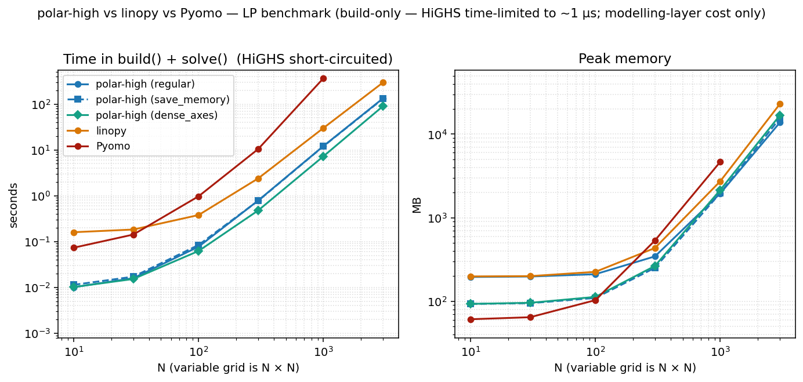
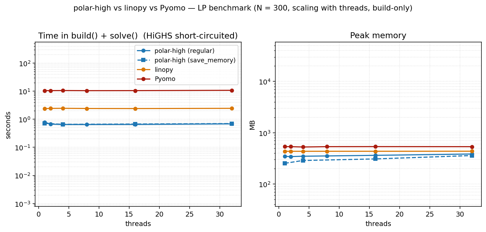
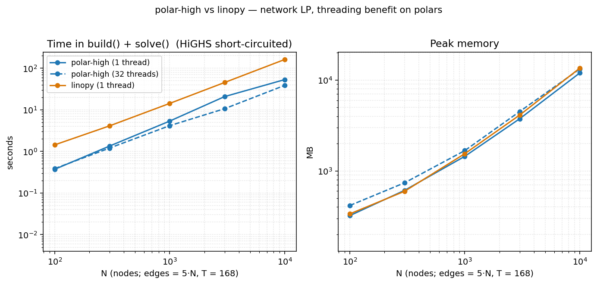
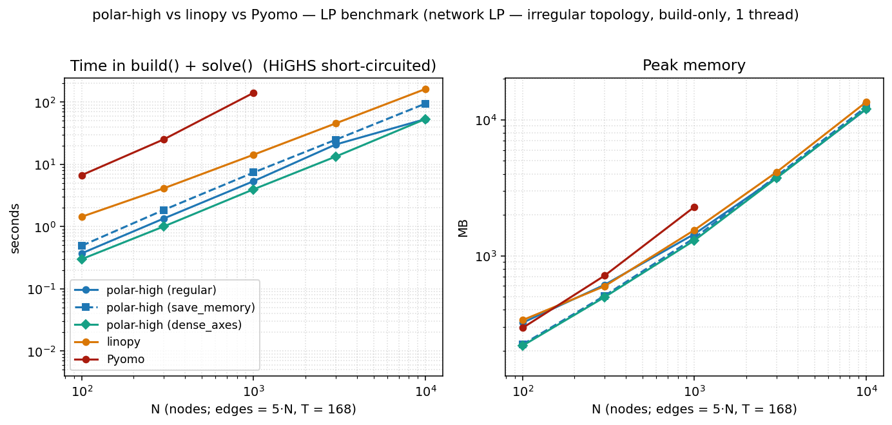
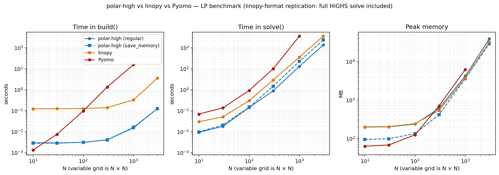

# Benchmark

Reproducible build / solve / memory comparison between **polar-high**,
**linopy**, and **Pyomo** on indexed linear programs, all using
**HiGHS** as the solver. The dense-LP test follows
[linopy's benchmark](https://linopy.readthedocs.io/en/latest/benchmark.html),
restricted to the linear case so polar-high can run it directly.

The benchmark is a manual artefact, not a CI workflow; runner
variability would make CI numbers misleading. The model code, runner,
and plot script live under
[`benchmark/`](https://github.com/nodal-tools/polar-high/tree/main/benchmark)
so anyone can re-run on their own hardware in a few minutes.

## Headline — dense LP, build-only, single-thread

{ loading=lazy }

Two panels: total time = `build()` + `solve()`, and peak memory.
HiGHS is time-limited to 1 µs so the column reflects pure
modelling-layer cost: what each tool spends turning Python into
something HiGHS can chew on. polar-high and linopy run at
`POLARS_MAX_THREADS=1` / `OMP_NUM_THREADS=1`. Pyomo is
single-threaded by design.

The dense LP that drives this figure (linopy's original model,
restricted to LP):

```text
min  Σ_{i,j} (2·x[i,j] + y[i,j])
s.t. x[i,j] - y[i,j] >= i          for i,j ∈ {1,…,N}
     x[i,j] + y[i,j] >= 0          for i,j ∈ {1,…,N}
     x, y >= 0
```

Variables: `2·N²`. Constraints: `2·N²`. Closed-form optimum
`obj = N²·(N+1)`, used as the cross-tool correctness anchor.

At N=3000 (a 18 M-variable LP):

| | total time | peak memory |
|---|---:|---:|
| polar-high | 96 s | 12.7 GB |
| linopy | 290 s | 23.6 GB |
| Pyomo | (caps at N=1000) | (4.7 GB at N=1000) |

polar-high is roughly 3× faster than linopy and uses about half the
memory at N=3000. Pyomo's per-coefficient Python overhead makes it
unable to keep up past N≈1000 in our 10-minute timeout.

### Note on the memory column

Peak RSS scales roughly linearly with `nnz` for all three tools, but
the slope between Pyomo and the columnar tools differs by an order of
magnitude. Pyomo carries each LP coefficient as a small Python
expression-tree node (a `VarData` reference plus a numeric multiplier
inside a `MonomialTermExpression`). CPython stores each of those at
roughly 100–200 bytes once header, type pointer, refcount, and per-
object dict are accounted for. polar-high and linopy hold coefficients
as contiguous Arrow / numpy buffers of about 16 bytes per nonzero. At
4 M nonzeros the representation difference compounds to a multi-GB
peak gap.

Between the two columnar tools the comparison flips depending on the
test:

- **At full HiGHS solve** (the linopy-format replication figure
  below): linopy's peak at N = 1000 is *below* polar-high's. xarray's
  dense-broadcast representation is genuinely compact on this regular
  `N × N` grid, and HiGHS's own working set then dominates everyone's
  total.
- **In the build-only headline above**: polar-high sits below linopy
  at large N. Two factors contribute, in unknown proportion. First,
  streaming constraint assembly (polar-high emits LP rows per family
  and releases each family's intermediates before the next; linopy
  materialises all coefficients at once). Second, the LP-file vs
  direct handoff (the build-only test exercises linopy's
  `io_api="lp"` path, the configuration where our `time_limit`
  short-circuit reliably reaches HiGHS, which serializes the LP
  through an intermediate text format; polar-high skips that step
  via `highspy`).

The honest take-away: which tool wins on memory depends on which
phase of the build/solve cycle dominates your run. Re-run on your own
model before assuming any of these ratios apply.

## Reproducing

```bash
git clone https://github.com/nodal-tools/polar-high.git
cd polar-high
pip install -r benchmark/requirements.txt
python benchmark/run.py            # ~10 min on a laptop
python benchmark/plot.py           # writes docs/assets/benchmark*.png
```

`benchmark/run.py` accepts `--sizes`, `--tools`, `--threads`,
`--repeats`, `--time-limit`. Each `(tool, N)` cell runs in a fresh
subprocess so caches and Python state don't carry over. The plot
takes the median across reps. See
[`benchmark/README.md`](https://github.com/nodal-tools/polar-high/blob/main/benchmark/README.md)
for the methodology details.

## Threading: defaults and where it matters

polar-high sets `POLARS_MAX_THREADS=1` at import. The data below
shows why.

### Scaling with threads at small N

{ loading=lazy }

At a small problem size (N=300) the build is too small to amortize
Rayon's coordination overhead. **All three tools are essentially
flat** across thread counts. polars's parallelism doesn't pay; linopy
and Pyomo are single-threaded by design. polar-high's peak memory
rises slightly with threads (per-thread scratch buffers, ~1.5 MB per
thread on this LP) without a corresponding time win.

### Scaling with threads on a larger LP

{ loading=lazy }

On the network LP (irregular topology, T=168, see below), polar's
threading does start paying as N grows, and grows steadily:

| N | polar 1 thread | polar 32 threads | speedup |
|---:|---:|---:|---:|
| 100 | 0.30 s | 0.26 s | 1.16× |
| 300 | 1.08 s | 0.84 s | 1.29× |
| 1 000 | 4.08 s | 3.18 s | 1.28× |
| 3 000 | 15.5 s | 10.8 s | 1.43× |
| 10 000 | 60.0 s | 40.5 s | **1.48×** |

At threads=32, polar uses ~25 % more memory than at threads=1
(per-thread Rayon scratch). The takeaway:

- **Default threads=1** is the right choice for typical workloads.
  Faster *and* leaner on small/medium LPs; only modestly slower than
  threads=32 even at large N.
- **Override to threads=N** by setting `POLARS_MAX_THREADS` *before*
  importing polar-high. Worth doing for genuinely large indexed LPs
  where you've checked that the polars-side build is the bottleneck.

```bash
POLARS_MAX_THREADS=8 python my_model.py
```

## Network LP: irregular topology

{ loading=lazy }

The dense `N × N` headline above is the model linopy's benchmark
uses, and it's flattering to xarray: every cell has the same shape,
indexing is rectangular, and dense numpy arrays compress the
coefficient matrix. Real indexed LPs (energy systems, supply chains)
aren't shaped that way. They have **irregular topology**: flow
variables on edges, balance constraints on nodes, with an edge→node
lookup that varies per node.

The network LP captures that:

```text
N nodes, E = 5·N edges drawn at random (Hamiltonian cycle + 4·N random),
T = 168 time steps (one week of hours)

vars     flow[e, t] >= 0
cstr 1   flow[e, t] <= cap[e, t]                                  ∀ (e, t)
cstr 2   Σ_{e: dst[e]=n} flow[e,t] − Σ_{e: src[e]=n} flow[e,t]
                                            == demand[n, t]       ∀ (n, t)
obj      min Σ cost[e] · flow[e, t]
```

The node-balance constraint requires an edge→node lookup. polar-high
expresses this as a polars join (`Where(flow, edges_dst_n)`); linopy
uses `flow.groupby(dst_array).sum()`; Pyomo precomputes
`incoming[n]` adjacency dicts and iterates them. Each idiom is
natural to its tool.

At N=10 000 (≈ 8.4 M variables, ≈ 10 M constraints):

| | total time | peak memory |
|---|---:|---:|
| polar-high | 60 s | 8.0 GB |
| linopy | 146 s | 13.7 GB |
| Pyomo | timed out at N=3000 | — |

polar wins all three columns and Pyomo can't finish at this scale
inside our 10-minute timeout. Notably, **linopy's memory advantage on
the dense LP doesn't carry over here**. The irregular `(e, t) →
(n, t)` join breaks xarray's dense-broadcast pattern, while polar's
join semantics map naturally onto the operation.

## Replication: linopy's original benchmark format

{ loading=lazy }

This is the same dense LP at threads=1 in the linopy benchmark's
original three-panel format: build / solve / memory shown
separately, with the **full HiGHS solve** included (no time limit).
We include it for direct visual comparison with linopy's published
numbers and as the methodology footnote.

**Caveat: read with care.** The `build()` / `solve()` split is *not*
an apples-to-apples decomposition across tools. Each library draws
the boundary in a different place:

- **polar-high's `build()`** registers metadata only. The matrix
  assembly happens inside `solve()` alongside the HiGHS call.
- **linopy's `build()`** materialises xarray coefficient arrays
  eagerly; `solve()` writes them to an LP file and hands it to
  HiGHS.
- **Pyomo's `build()`** instantiates `VarData` / `ConstraintData` /
  `MonomialTermExpression` Python objects per coefficient. Most of
  the work happens here; `solve()` walks the expression tree to
  emit the LP.

So when you compare the *build column* between tools, you're
comparing what each tool *chose* to put in `build()`. The
apples-to-apples cross-tool measurement is `build() + solve()`,
which is the headline figure at the top of this page.

That said, the replication is faithful: the closed-form objective is
hit exactly, the model is the same LP, and HiGHS solves the same
sparse matrix. linopy's numbers reproduce within run-to-run noise.

## Fairness caveats

- Each tool builds the LP in its own natural style; the closed-form
  objective (or cross-tool agreement on the network LP) confirms
  they're all solving the same problem.
- Pyomo's solve uses the **`appsi_highs`** persistent-solver
  interface, the fastest Pyomo→HiGHS path. The file-based
  `SolverFactory("highs")` route would inflate Pyomo's solve time
  with LP-write/reread overhead.
- linopy uses **`io_api="lp"`** explicitly: the configuration where
  our `time_limit` short-circuit reliably reaches HiGHS for the
  build-only test. linopy's `io_api="direct"` is faster on full
  solves but interacts awkwardly with the time-limit short-circuit.
- polar-high's solve calls into `highspy` directly with no
  intermediate file in either configuration.
- HiGHS itself stays at 1 thread across all tools, so the solve
  column remains apples-to-apples.
- Each `(tool, N)` cell runs in a fresh Python process, so caches
  and memory don't carry over between cells. Python startup costs
  ~50 ms per cell, negligible at our sizes.
- One machine, one Python version, one HiGHS version. Re-run on your
  own hardware before reading too much into the absolute numbers;
  the *ratios* between tools are what's portable.

## What's not in the benchmark

- **MIP**, **QP**, **warm starts**, and **Lagrangian decomposition**.
  The benchmark deliberately exercises the matrix-assembly path on
  plain LPs.
- **JuMP** and **gurobipy**. Both have toolchain or licence friction
  that defeats "anyone can re-run from a clean `pip install`".

If you'd like a different model class (block-angular, time-coupled,
mixed-integer with branching) in the benchmark, open an issue. The
runner is a small enough surface to extend.
